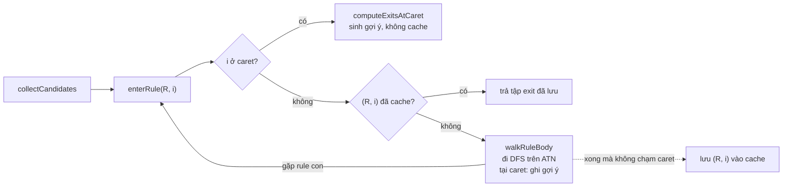

# Tầng cú pháp hoạt động thế nào

Tầng cú pháp trả lời câu hỏi: tại vị trí con trỏ, về mặt ngữ pháp được phép gõ token nào hoặc rule nào. Nó không parse
câu SQL mà đi trực tiếp trên ATN (máy trạng thái ANTLR sinh ra từ grammar). Mã nằm ở `completion/syntactic/`. Bức tranh
tổng thể cả hai tầng xem [how-it-works.md](how-it-works.md).

## ATN là gì

ATN là grammar được vẽ lại thành sơ đồ đường đi: mỗi **state** là 1 điểm dừng, mỗi **transition** là 1 mũi tên ghi
token cần "ăn" để đi qua. ANTLR dựng sẵn sơ đồ này cho parser, lấy bằng `parser.getATN()`. Gợi ý = đi theo sơ đồ bằng
các token đã gõ, rồi xem ở chỗ đang đứng có những mũi tên nào đi ra.

### Bước 1: rule chỉ có 1 đường

```
stmt : SELECT ID FROM ID ;

(0) --SELECT--> (1) --ID--> (2) --FROM--> (3) --ID--> (4 = cuối rule)
```

Input `SELECT a FROM |`: bắt đầu ở (0), ăn `SELECT` sang (1), ăn `a` (là `ID`) sang (2), ăn `FROM` sang (3). Hết token
đã gõ, đang đứng ở (3). Mũi tên đi ra khỏi (3) ghi `ID`, nên gợi ý là `ID` (một tên bảng).

Nếu token đã gõ không khớp mũi tên nào (ví dụ `SELECT a WHERE`), đường đó chết và không có gợi ý.

### Bước 2: có lựa chọn

```
stmt : SELECT ID (WHERE ID)? ;

(0) --SELECT--> (1) --ID--> (2) --WHERE--> (3) --ID--> (4 = cuối rule)
(2) --ε--> (4)          ← mũi tên thêm do dấu ?, bỏ qua cả (WHERE ID)
```

`?` tạo thêm 1 mũi tên **ε (epsilon)**: đi qua không cần token. Input `SELECT a |` đứng ở (2), có 2 mũi tên ra:

- mũi tên `WHERE`: gợi ý `WHERE`;
- mũi tên ε: nhảy thẳng tới cuối rule, tức câu có thể kết thúc ở đây, nên gợi ý thêm những gì đứng sau `stmt`.

`*`, `+`, `|` cũng sinh ra mũi tên ε theo cách tương tự. Vì vậy 1 state thường có nhiều mũi tên ra, và engine phải đi
thử tất cả.

### Bước 3: rule gọi rule

```
stmt   : SELECT column FROM ID ;
column : ID | STAR ;

stmt:    (0) --SELECT--> (1) --[gọi column]--> (2) --FROM--> (3) --ID--> (4 = cuối)
column:  (5) --ID--> (6 = cuối)
         (5) --STAR--> (6)
```

Mũi tên `[gọi column]` không ăn token mà nhảy sang sơ đồ của `column` ở (5). Tới cuối `column` ở (6), phải quay lại
đúng chỗ sau mũi tên gọi, là (2). Chỗ quay về đó gọi là **followState**.

Sơ đồ không tự nhớ ai đã gọi `column`. Trong grammar thật, 1 rule như `column_name` được gọi từ rất nhiều chỗ, nên tới
cuối rule thì không biết quay về đâu. Engine tự nhớ bằng cách đi `column` trong 1 lần gọi `enterRule` riêng. Lần gọi
đó trả về "ra khỏi `column` được ở token nào", rồi engine đi tiếp từ (2) với từng token đó. Phần
[Thuật toán](#thuật-toán-enterrule-và-walkrulebody) nói chi tiết.

### Khác gì parser thật

Parser thật chỉ chọn 1 đường (`adaptivePredict`) và dừng ở lỗi đầu tiên. Engine thì đi mọi đường còn khớp với token đã
gõ, nên tới caret nó thấy tất cả những gì grammar cho phép.

### Tên trong code

Sơ đồ trên đã được vẽ gọn: ANTLR thật chèn thêm vài state ε ở đầu và cuối mỗi block.

| Khái niệm              | Trong code                                                                          |
|------------------------|-------------------------------------------------------------------------------------|
| State đầu / cuối rule  | `atn.ruleToStartState[ruleIndex]`, `atn.ruleToStopState[ruleIndex]` (`RULE_STOP`)   |
| Mũi tên ra của 1 state | `state.getTransitions()`                                                            |
| Mũi tên ăn token       | `AtomTransition`, `SetTransition` (tập token trong `label()`), `NotSetTransition`   |
| Mũi tên `.`            | `WildcardTransition`: ăn 1 token bất kỳ                                             |
| Mũi tên ε              | `t.isEpsilon()`                                                                     |
| Mũi tên có điều kiện   | `PredicateTransition` (`{p.isVersion12()}?`): ε chỉ đi được khi predicate đúng      |
| Mũi tên gọi rule       | `RuleTransition`: `target` = state đầu rule con, `followState` = chỗ quay về        |

## Luồng xử lý

Với Oracle (`OracleSyntacticAnalyzer.analyze(sql, cursorOffset)`):

1. `PlSqlLexer` tách câu thành token. `PlSqlParser` được tạo chỉ để lấy ATN và đánh giá predicate, không gọi hàm parse
   nào.
2. `TokenPositions.findCaretTokenIndex` đổi vị trí ký tự của con trỏ thành chỉ số token (token caret).
3. `CompletionEngine` (hiện dùng `CompletionEngineDefault`) đi trên ATN từ rule số 0 với các token trước caret.
4. Kết quả là một `CandidatesResult`:
    - `tokens`: loại token gợi ý → chuỗi token chắc chắn đi liền sau;
    - `rules`: preferred rule gợi ý → đường gọi tới nó;
    - `ruleEntryTokenIndex`: preferred rule → token mà rule bắt đầu.

Tầng suggestion (`OracleMatchedRuleResolver`, `PostgresMatchedRuleResolver`) dùng `rules` và `ruleEntryTokenIndex` để
quyết định gợi ý tên bảng, tên cột…, còn `tokens` thành gợi ý từ khoá.

| File (`completion/syntactic/engine/`) | Vai trò                                                   |
|---------------------------------------|-----------------------------------------------------------|
| `CompletionEngineBase`                | Thuật toán chung: `enterRule`, `walkRuleBody`, cache      |
| `CompletionEngineDefault`             | Chế độ đơn giản, luôn đi trong thân rule                  |
| `CompletionEngineWithFlowSet`         | Dùng follow-set tính sẵn để cắt nhánh và sinh gợi ý nhanh |
| `support/FollowSetsByState`           | Tính và cache follow-set cho từng state đầu rule          |
| `support/PreferredRuleResolver`       | Ghi preferred rule vào kết quả                            |
| `support/RuleCallStack`               | Đường gọi rule, copy O(1)                                 |
| `support/FollowingTokensFinder`       | Chuỗi token chắc chắn đi sau 1 transition                 |
| `support/AtnPredicates`               | Đánh giá predicate `{...}?` của grammar                   |

## Token đã gõ và token caret

Engine làm việc trên danh sách `tokens`: mọi token từ đầu câu tới token caret, token caret nằm cuối. Token caret không
bao giờ được "ăn"; engine hỏi xem chỗ đó có thể là gì.

- **Token caret** do `TokenPositions.findCaretTokenIndex` chọn: token trên default channel chứa vị trí con trỏ, hoặc
  token đầu tiên bắt đầu sau con trỏ, hoặc EOF nếu con trỏ ở cuối câu. Khi con trỏ dính vào cuối một định danh,
  `CompletionInputPreparer` lùi vị trí 1 ký tự để định danh dở đó trở thành token caret.
- **`readTokens`** đọc qua `stream.LT(i)`, nên token ở channel ẩn (khoảng trắng, comment) bị bỏ. Nó dừng khi tới token
  caret hoặc EOF, rồi trả stream về vị trí cũ.
- **`isAtCaret(i)`** là `i >= tokens.size() - 1`. Token index trong lúc đi không bao giờ vượt quá caret, vì engine chỉ
  tăng index khi chưa tới caret.

Ví dụ `SELECT a FROM t WHERE |`: `tokens` = `SELECT a FROM t WHERE EOF`, token caret là EOF ở index 5. Engine phải khớp
đúng 5 token đầu, và mọi token mà ATN chấp nhận ở index 5 là gợi ý.

## Thuật toán: enterRule và walkRuleBody

Thuật toán là 2 hàm gọi đệ quy lẫn nhau. `enterRule` hỏi "vào rule R tại token i thì ra khỏi R được ở những token nào?";
`walkRuleBody` đi trong thân R để trả lời, và gặp rule con thì lại hỏi `enterRule`.



**Tập exit.** Kết quả của `enterRule(R, i)` là tập token index mà tại đó tới được cuối R (state `RULE_STOP`). Ví dụ với
`r : X Y? ;` và input `X Y Z`, `enterRule(r, 0)` = `{1, 2}`: ra sau khi ăn `X`, hoặc sau khi ăn cả `X Y`. Tập rỗng nghĩa
là nhánh đó chết.

**`enterRule(start, i, caller)`**:

1. Nếu `i` đã ở caret, gọi hook `computeExitsAtCaret` (sinh gợi ý) và trả về luôn, không cache.
2. Nếu (R, i) có trong `ruleExitCache` thì trả về kết quả đã lưu.
3. Ngược lại, đặt tạm tập rỗng vào cache (chống lặp vô hạn), gọi hook `computeExitsNotAtCaret`, rồi lưu kết quả nếu lần
   đi đó không chạm caret (xem phần cache).

**`walkRuleBody(start, i, stack)`** duyệt DFS các `Position(state, tokenIndex)`, dùng `visited` để không đi lại cùng
cặp. `stack` là đường gọi tới rule này và cố định trong suốt lần đi. Tới `RULE_STOP` thì thêm token index hiện tại vào
tập exit. Ngược lại, xử lý từng transition:

| Transition          | Trước caret                                                  | Tại caret                                                                                                   |
|---------------------|--------------------------------------------------------------|-------------------------------------------------------------------------------------------------------------|
| Epsilon             | Đi tiếp, không tốn token                                     | Như trước caret                                                                                             |
| Predicate `{...}?`  | Đi tiếp nếu `AtnPredicates.holds` đúng                       | Như trước caret                                                                                             |
| Gọi rule con        | `enterRule(con, i)`, rồi đi tiếp từ `followState` ở mọi exit | Nếu đường gọi có preferred rule thì ghi rule, chỉ đi tiếp khi rule con rỗng được; không thì gọi `enterRule` |
| Atom / Set / NotSet | Khớp token thứ i thì sang i + 1, không khớp thì nhánh chết   | Ghi preferred rule nếu có, không thì ghi mọi token của label vào `result.tokens`                            |
| Wildcard `.`        | Luôn sang i + 1                                              | Ghi preferred rule nếu có, không thì ghi mọi token của grammar                                              |

Khi transition chỉ có đúng 1 token, `FollowingTokensFinder` tìm thêm chuỗi token chắc chắn đi liền sau nó (ví dụ
`ORDER` → `BY`). Nếu cùng 1 token được gợi ý từ 2 chỗ với chuỗi theo sau khác nhau, `CandidatesResult.addToken` để chuỗi
đó rỗng.

Lần gọi đầu tiên là `enterRule(rule 0, token 0, stack rỗng)`. Mọi gợi ý được ghi thẳng vào `result` trong lúc đi; giá
trị trả về của lần gọi đầu bị bỏ qua.

## Preferred rules và ignored tokens

Preferred rule là rule được gợi ý nguyên khối thay vì bung ra từng token bên trong. Với Oracle đó là các rule như
`column_name`, `table_alias`, `function_name`, `identifier`, `regular_id` (xem
`OracleSyntacticAnalyzer.buildPreferredRules`). Nếu không có chúng, caret sau `WHERE` sẽ sinh hàng nghìn keyword có thể
dùng làm identifier.

**Cách ghi.** Mỗi khi tại caret sắp sinh token, engine gọi `PreferredRuleResolver.resolve(stack)`:

1. Quét `stack` từ rule ngoài cùng vào trong; gặp preferred rule đầu tiên thì dừng.
2. Ghi `result.rules[rule]` = đường gọi tới rule đó, và `result.ruleEntryTokenIndex[rule]` = token mà rule bắt đầu.
3. Trả về true; engine bỏ qua token của nhánh đó.

Nếu 1 preferred rule được chạm từ nhiều nhánh, bản ghi có token bắt đầu muộn hơn thắng.

**`RULE_STOP` tại caret** cũng gọi `resolve`. Nhờ vậy, khi caret nằm ngay sau 1 preferred rule vừa kết thúc, rule đó vẫn
được ghi lại.

**Ignored tokens** (`buildIgnoredTokens`) chỉ lọc đầu ra: token trong danh sách này không bao giờ vào `result.tokens`
hay chuỗi token theo sau. Chúng vẫn được khớp bình thường khi nằm trước caret.

## Cache ruleExitCache

`ruleExitCache` lưu `rule → (token vào → tập exit)`, chỉ cho những lần đi không chạm caret. Cache được xoá ở đầu mỗi lần
`collectCandidates`.

**Vì sao cần cache.** Cùng 1 rule thường được vào tại cùng token từ nhiều alternative (ví dụ `expression` được gọi từ
hơn 150 chỗ trong grammar PL/SQL). Không có cache thì mỗi lần lại đi lại toàn bộ thân rule.

**Vì sao lần đi chạm caret không được cache.** Tập exit chỉ phụ thuộc (rule, token vào), nhưng gợi ý sinh ra tại caret
còn phụ thuộc call stack: cùng một chỗ, đi qua preferred rule `p` thì ghi rule `p`, đi qua rule thường `q` thì ghi
token. Nếu cache lần đi đầu, caller thứ hai sẽ nhận tập exit mà không sinh gợi ý của mình:

```
start : (p | q) EOF ;   p : r ;   q : r ;   r : X Y ;
input "x|"  → cần có cả rule p lẫn token Y
```

**Cách biết 1 lần đi có chạm caret.** Biến đếm `caretTouches` tăng mỗi khi việc đi tới caret, ở 2 chỗ:

- trong `enterRule` khi rule được vào ngay tại caret (bắt được cả lớp con không gọi `walkRuleBody`);
- trong `walkRuleBody` khi 1 `Position` nằm ở caret (rule vào trước caret rồi đi tới caret).

`enterRule` so giá trị trước và sau khi tính: tăng lên nghĩa là lần tính đó, kể cả các rule con bên trong, đã tới caret.
Khi đó nó xoá tập rỗng đặt tạm khỏi cache thay vì lưu kết quả. Rule con không chạm caret vẫn được cache bình thường.

Chỉ những rule nằm trên đường tới caret bị đi lại, nên chi phí thêm nhỏ: trên grammar PL/SQL, các câu thử chậm từ 0–1 ms
lên 1–4 ms.

## Hai chế độ: Default và WithFlowSet

Hai lớp con chỉ khác nhau ở 3 hook của `CompletionEngineBase`. `CompletionEngine` hiện dùng `CompletionEngineDefault`.

| Hook                     | `CompletionEngineDefault`                           | `CompletionEngineWithFlowSet`                                                                                        |
|--------------------------|-----------------------------------------------------|----------------------------------------------------------------------------------------------------------------------|
| `computeExitsNotAtCaret` | Đi trong thân rule                                  | Nếu token kế tiếp không nằm trong follow-set và rule không rỗng được thì bỏ nhánh ngay; không thì đi trong thân rule |
| `computeExitsAtCaret`    | Đi trong thân rule                                  | Sinh gợi ý thẳng từ follow-set, không đi trong thân rule                                                             |
| `isNullable`             | Dò ATN qua epsilon, predicate và rule con rỗng được | Tra follow-set có chứa `EPSILON` không                                                                               |

**Follow-set** (`FollowSetsByState`) là mọi token có thể đứng đầu khi vào 1 rule, đi xuyên qua rule con. Mỗi nhóm
token (`FollowSetWithPath`) mang theo:

- `intervals`: các loại token;
- `path`: các rule con đã vào để tới nhóm này, dùng để kiểm preferred rule;
- `following`: chuỗi token chắc chắn đi liền sau.

`EPSILON` trong tập nghĩa là rule có thể rỗng. Khi đi ra khỏi rule con, `path` trở lại đường gọi của caller (
`ReturnTo`). Nhờ vậy token nằm sau 1 rule con rỗng được không bị tính là thuộc rule con đó.

Follow-set không phụ thuộc token đã gõ, nên được cache tĩnh, dùng chung giữa các lần gọi và các luồng, với key (ATN,
state, ignoredTokens). Lần gọi đầu trên PL/SQL tốn 3–25 ms vì phải tính follow-set.

## Giới hạn và lưu ý

- **Không phục hồi lỗi.** Token đã gõ mà không khớp ATN thì nhánh đó chết. Nếu mọi nhánh đều chết (ví dụ gõ sai 1 từ
  khoá ở đầu câu), kết quả là 0 gợi ý.
- **Predicate đánh giá không có ngữ cảnh parse.** `AtnPredicates` dùng `ParserRuleContext.EMPTY`. Điều này đúng với
  predicate chỉ đọc cờ parser (`isVersion12()`). `isTableAlias()` đọc `getCurrentToken()`, tức token đầu câu, không phải
  token đang xét.
- **Cache follow-set tĩnh giữ kết quả predicate của lần tính đầu.** Hiện chưa sai vì `setVersion12` không được gọi ở
  đâu. Nếu sau này bật cờ version theo kết nối, cần thêm cờ vào key cache.
- **Đệ quy trái.** ANTLR đã viết lại đệ quy trái trực tiếp thành vòng lặp, nên `enterRule` không vào lại đúng (rule,
  token) đang tính. Tập rỗng đặt tạm trong cache chỉ là lớp bảo vệ thêm.
- **Instance không dùng chung giữa các luồng.** Engine giữ `tokens`, `result`, cache của lần gọi hiện tại; mỗi lần phân
  tích tạo engine mới.

## Test

`CompletionEngineBaseTest` dựng grammar nhỏ lúc chạy bằng `ParserInterpreter` (cần dependency `antlr4` scope test) và
chạy mỗi case với cả 2 engine:

1. Rule vào tại cùng token từ 2 caller: cache không nuốt gợi ý của caller thứ 2.
2. Token vừa từ transition thường vừa từ wildcard: chuỗi theo sau bị bỏ.
3. Gọi cùng 1 rule con rỗng được 2 lần liền: follow-set không dừng ở lần thứ 2.
4. Token sau 1 preferred rule rỗng được không bị nuốt.
