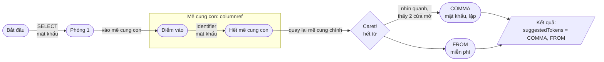
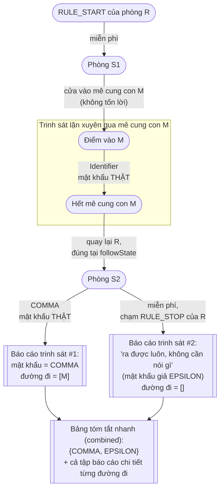
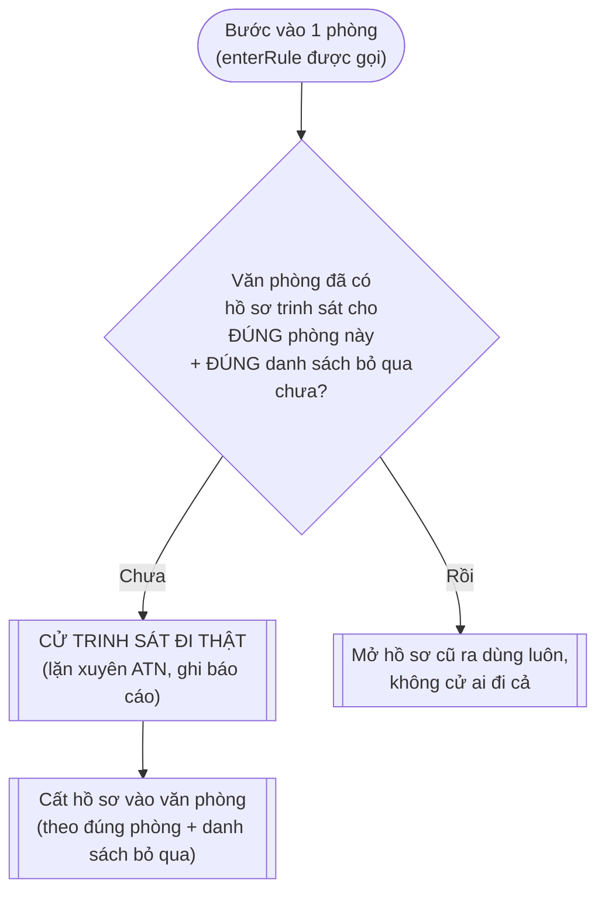
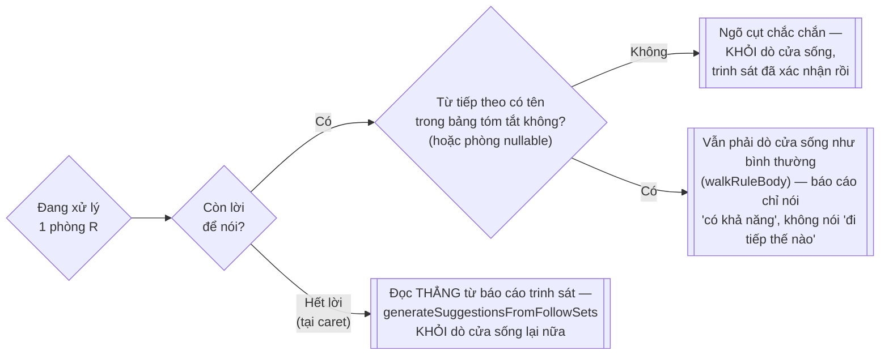
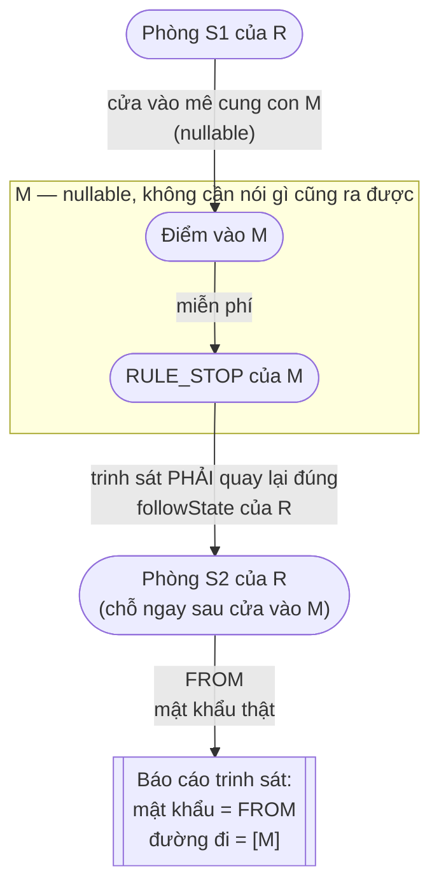
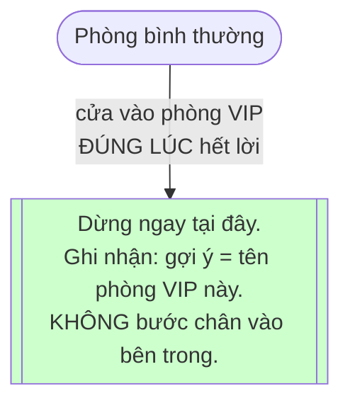
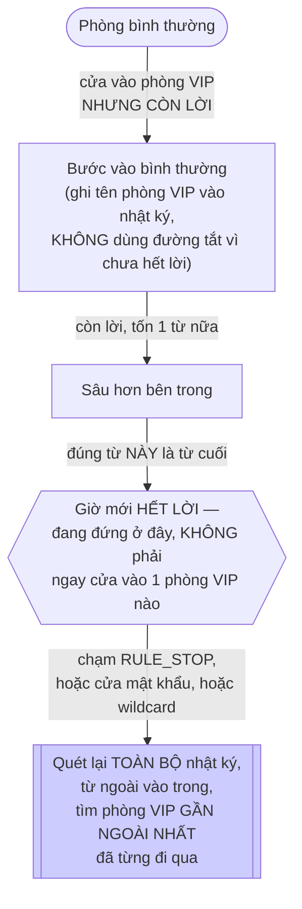

# ATN giải thích bằng ẩn dụ phòng và cửa

## Tưởng tượng grammar là 1 tấm bản đồ trò chơi

Bạn đang chơi 1 trò chơi: mỗi lượt bạn đứng ở **1 căn phòng**, và từ phòng đó có vài **cánh cửa** dẫn sang phòng khác.

Để đi qua 1 cánh cửa, có 3 loại:

1. **Cửa cần mật khẩu** — bạn phải nói đúng 1 từ cụ thể (vd phải nói "SELECT") thì cửa mới mở, và bạn *tốn 1 lượt nói*
   để qua cửa đó.
2. **Cửa miễn phí** — mở sẵn, bạn cứ bước qua, không cần nói gì, không tốn lượt nào cả.
3. **Cửa dẫn vào 1 mê cung con** — bước qua cửa này nghĩa là bạn phải đi hết 1 mê cung nhỏ khác trước (đi qua nhiều
   phòng, nói nhiều mật khẩu khác), xong xuôi mới được quay lại mê cung chính, đúng tại điểm ngay sau cửa, để tiếp tục
   đi tiếp.

**ATN chính là tấm bản đồ này.** Mỗi rule trong grammar là 1 mê cung. `RuleTransition` là "cửa dẫn vào mê cung con" (mê
cung con = rule khác). Cửa miễn phí chính là cái người ta gọi là "epsilon" — chỉ là 1 cái tên kỹ thuật cho "cửa không
cần nói gì".

## Việc engine đang làm

Bạn đưa cho engine 1 câu bạn đã nói (`SELECT name`), engine **giả vờ đi trong mê cung** đúng theo những từ đó — mỗi từ
bạn nói khớp với đúng 1 cửa cần mật khẩu, nó bước qua. Khi bạn nói hết câu (caret), nó đang đứng ở **1 căn phòng cụ thể
nào đó**. Lúc đó nó nhìn quanh phòng: *"phòng này có những cửa nào?"* — tên mật khẩu trên mỗi cửa đó chính là **gợi ý**
cho bạn.

## Sơ đồ minh hoạ



## Đi qua từng hàm trong code, theo đúng câu chuyện trên

> Từ đây trở đi, tên hàm và chữ ký khớp đúng bản hiện tại của engine (`CompletionEngineBase` + 2 lớp con
> `CompletionEngineDefault` / `CompletionEngineWithFlowSet`), không phải bản gộp-1-file cũ. Mỗi hàm dưới đây đều nhận
> thêm 1 tham số `RuleCallStack stack` — coi nó như **cuốn nhật ký đường đi**: mỗi khi bước vào 1 mê cung con, tên mê
> cung đó được ghi thêm vào cuốn nhật ký. Phần vì sao cần cuốn nhật ký này được giải thích kỹ ở mục "Phòng VIP" bên
> dưới — tạm thời cứ đọc như thể nó không tồn tại cũng được, không ảnh hưởng tới lõi thuật toán dò cửa.

**`collectCandidates(caretTokenIndex)`** — đây là lúc bạn bắt đầu ván chơi. Nó dọn sạch kết quả cũ, đọc lại toàn bộ
những lời bạn đã nói (`readTokens`), rồi bước chân vào mê cung chính (rule gốc của grammar), tại đúng ô đầu tiên trên
bàn cờ (`tokenIndex = 0`), với 1 cuốn nhật ký còn trắng tinh (`new RuleCallStack()`). Mọi thứ xảy ra sau đó chỉ là hệ
quả của 1 lời gọi duy nhất: `enterRule(start, 0, stack)`.

**`enterRule(start, tokenIndex, stack)`** — đây là hành động "bước vào 1 mê cung". Có 2 chế độ hoàn toàn tách biệt tuỳ
lớp con đang dùng (`CompletionEngineDefault` hay `CompletionEngineWithFlowSet`), nhưng ý tưởng chung giống nhau: trước
khi đi, nó tự hỏi *"mình đã từng đứng đúng chỗ này trong mê cung này chưa?"* Nếu rồi, khỏi mất công đi lại, lấy ngay kết
quả cũ ra dùng (`ruleExitCache`). Nếu chưa, nó đánh dấu tạm "chỗ này coi như ngõ cụt" (phòng khi đi vòng quay lại đúng
chỗ, khỏi lặp vô tận), ghi thêm rule này vào cuốn nhật ký, rồi mới thật sự đi: hết lời để nói thì nhìn quanh lấy gợi ý,
còn lời thì dò cửa đi tiếp (`walkRuleBody`). Xong xuôi, nó xoá cái đánh dấu tạm, ghi đè bằng kết quả thật.

**`canExitWithoutConsumingToken(parser, start)`** — câu hỏi ở đây rất cụ thể: *"đứng ngay tại cửa vào mê cung này, tôi
có thể coi như xong luôn mà không cần nói thêm lời nào không?"* Nó đi thử các cửa miễn phí và cửa vào mê cung con khác
(đều không tốn lời), hễ chạm được "hết mê cung" thì đúng — trả lời có. Gặp cửa mật khẩu là dừng ngay nhánh đó, vì cửa
mật khẩu đồng nghĩa "còn nợ ít nhất 1 lời". Hàm này không thuộc lõi thuật toán dò cửa — nó nằm riêng ở
`feature/NullableRuleChecker.java`, chỉ cần `(Parser, ATNState)`, không đụng gì tới cuốn nhật ký hay token đã gõ, nên
tách ra file riêng được.

**`walkRuleBody(start, startTokenIndex, stack)`** — đây là màn dò đường thật sự bên trong 1 mê cung. Nó đi từng phòng
một, và với mỗi phòng, xét hết các cửa của phòng đó rồi định tuyến sang đúng người xử lý cửa loại đó. Nếu 1 phòng nào
chạm tới "hết mê cung" (`RULE_STOP`) đúng lúc hết lời, nó còn tranh thủ hỏi luôn "có phòng VIP nào trên đường đi không"
(xem mục dưới), rồi mới ghi lại đây là 1 điểm có thể thoát ra.

**`handleRuleDoor`** — xử lý đúng cửa vào mê cung con. Có 2 khả năng: nếu đã hết lời VÀ mê cung con này là "VIP", nó
dùng đường tắt (xem mục "Phòng VIP"), không đi vào bên trong. Ngược lại, nó đi hết mê cung con đó bình thường (gọi lại
`enterRule`), rồi bất kể đi ra ở đâu, luôn tiếp tục từ đúng điểm ngay sau cửa (`rt.followState`) trong mê cung chính.

**`handleFreeDoorWithCondition`** và **`handleFreeDoor`** — đây là 2 kiểu cửa miễn phí: 1 loại có điều kiện đi kèm (mở
nếu điều kiện đúng), 1 loại mở sẵn hoàn toàn. Cả 2 đều không tốn lời nói, chỉ là bước qua rồi tiếp tục.

**`handlePasswordDoor`** — đây là nơi mọi gợi ý *dạng token* thật sự được sinh ra. Nếu hết lời để nói rồi, trước tiên nó
hỏi "phòng mình đang đứng có phải VIP không" — nếu có, chốt tên phòng VIP đó làm gợi ý, không liệt kê token trần trụi
nữa. Nếu không, tên mật khẩu trên cửa này chính là gợi ý, trừ khi nó nằm trong danh sách bị bỏ qua. Nếu còn lời, nó so
xem lời tiếp theo có đúng mật khẩu không — đúng thì bước qua (tốn 1 lời), sai thì im lặng, coi như ngõ cụt.

## Vì sao phải đi từ đầu, không nhảy thẳng tới Caret

Đúng là 1 khi đã biết chắc đang đứng ở đúng 1 ngã rẽ cụ thể, danh sách cửa ở đó là cố định — không quan tâm chữ trước đó
là gì. Nhưng vấn đề là: **làm sao biết mình đang đứng ở đúng ngã rẽ nào?**

Ví dụ 2 câu này đều "vừa gõ xong 1 identifier, hết từ":

- `SELECT name` → đang ở ngã rẽ `COMMA` / `FROM`
- `SELECT name FROM users WHERE id` → đang ở 1 ngã rẽ khác hẳn (so sánh `=`, `>`, `IN`...)

Cả 2 câu kết thúc giống hệt nhau về hình thức ("vừa gõ 1 identifier"), nhưng là 2 phòng khác nhau, cửa khác nhau hoàn
toàn. Không đi từ đầu thì không thể phân biệt được đang ở trường hợp nào — phải đi đúng đường mới xác định được đang
đứng ở phòng nào.

Tóm lại: đi từ đầu = xác định **đang đứng ở đâu**. Việc cử trinh sát đi trước dò sẵn 1 lần dùng lại mãi (đây là lý do
có `feature/FollowSetsByState.java` cho lớp con `CompletionEngineWithFlowSet`) là chuyện khác, không thay thế được việc
phải xác định vị trí trước.

Đi từ đầu còn giúp phát hiện input sai ngữ pháp: nếu gõ câu không hợp lệ (vd thiếu tên cột), tới cửa cần `Identifier` mà
không có token đó, code không push đi tiếp đâu cả — ngõ cụt, không phòng nào đạt tới, không có gợi ý (đúng như kỳ vọng:
câu sai thì không nên gợi ý bừa).

## Ví dụ mở rộng: nhiều nhánh hơn (vòng lặp + rẽ nhánh WHERE tuỳ chọn)

Grammar đầy đủ hơn: `select_stmt : SELECT columnref (COMMA columnref)* FROM qualified_name (WHERE bool_expr)? ;`

```mermaid
flowchart LR
    A([Bắt đầu]) -->|SELECT<br/>mật khẩu| B([Phòng 1])
    B -->|vào mê cung con| C1([Điểm vào])

    subgraph M1[" Mê cung con: columnref (cột) "]
        C1 -->|Identifier<br/>mật khẩu| D1([Hết mê cung con])
    end

    D1 -->|quay lại mê cung chính| E{Ngã rẽ 1<br/>hết từ?}
    E -->|COMMA<br/>mật khẩu, lặp lại| C1
    E -->|FROM<br/>miễn phí| G([Phòng sau FROM])
    G -->|vào mê cung con| H([Điểm vào])
    subgraph M2[" Mê cung con: qualified_name (tên bảng) "]
        H -->|Identifier<br/>mật khẩu| I([Hết mê cung con])
    end

    I -->|quay lại mê cung chính| J{Ngã rẽ 2<br/>hết từ?}
    J -->|WHERE<br/>mật khẩu| K([Phòng sau WHERE])
    J -->|miễn phí| L[/Kết thúc câu/]
    K -->|vào mê cung con| P([Điểm vào])
    subgraph M3[" Mê cung con: bool_expr (điều kiện) "]
        P -->|columnref, = , giá trị| Q([Hết mê cung con])
    end
    Q -->|quay lại mê cung chính| R[/Kết thúc câu/]
    E -.->|gợi ý tại Ngã rẽ 1| S1[/suggestedTokens = COMMA, FROM/]
    J -.->|gợi ý tại Ngã rẽ 2| S2[/suggestedTokens = WHERE, EOF/]
```



### Đi từng bước qua sơ đồ trên

**Bước 1 — `Bắt đầu → Phòng 1`**: nói `SELECT` (cửa mật khẩu), tốn 1 lời, bước qua.

**Bước 2 — `Phòng 1 → Điểm vào (columnref)`**: gặp cửa vào mê cung con — `enterRule()` được gọi đệ quy, đi vào mê cung
`columnref`. Cuốn nhật ký ghi thêm: `[..., columnref]`.

**Bước 3 — bên trong `M1`**: nói `Identifier` (tên cột đầu tiên), tốn 1 lời, chạm `Hết mê cung con` (`RULE_STOP` của
`columnref`).

**Bước 4 — `quay lại mê cung chính`**: thoát mê cung con, code nhảy đúng tới `rt.followState` — chính là **Ngã rẽ 1**.
Cuốn nhật ký xoá dòng `columnref` vừa ghi (đã ra khỏi mê cung đó rồi).

**Bước 5 — tại Ngã rẽ 1, nếu hết từ**: nhìn quanh thấy 2 cửa mở — `COMMA` và `FROM` → `suggestedTokens = {COMMA, FROM}`.

**Bước 6a — nếu người dùng gõ tiếp `,`**: đi theo cửa `COMMA`, quay ngược lại đúng `Điểm vào (columnref)` — vòng lặp
`(COMMA columnref)*` lặp thêm 1 vòng, quay lại Bước 2.

**Bước 6b — nếu gõ tiếp `FROM`**: cửa mật khẩu bình thường (không dẫn vào mê cung con) — sang `Phòng sau FROM`.

**Bước 7 — `Phòng sau FROM → Điểm vào (qualified_name)`**: lại 1 cửa vào mê cung con khác — đệ quy `enterRule()` lần
nữa, lần này vào mê cung `qualified_name`.

**Bước 8 — bên trong `M2`**: nói `Identifier` (tên bảng), chạm `Hết mê cung con`.

**Bước 9 — `quay lại mê cung chính`**: thoát mê cung con lần 2, nhảy tới `followState` mới — đây chính là **Ngã rẽ 2**,
hoàn toàn khác Ngã rẽ 1 dù cùng "vừa nói xong 1 Identifier, hết từ".

**Bước 10 — tại Ngã rẽ 2, nếu hết từ**: nhìn quanh thấy 2 cửa — `WHERE` và "kết thúc câu" (`EOF`/miễn phí) →
`suggestedTokens = {WHERE, EOF}`.

**Bước 11a — nếu gõ tiếp `WHERE`**: sang `Phòng sau WHERE`, lại gặp cửa vào mê cung con `bool_expr`, lặp lại đúng cơ
chế "vào mê cung con → quay lại mê cung chính" lần thứ 3, rồi tới `Kết thúc câu`.

**Bước 11b — nếu không gõ `WHERE`**: đi thẳng cửa miễn phí, câu kết thúc luôn tại Ngã rẽ 2.

**Điểm mấu chốt xuyên suốt cả 11 bước**: mỗi lần "vào mê cung con → quay lại mê cung chính" đều dùng đúng 1 cơ chế duy
nhất trong code — `handleRuleDoor` gọi đệ quy `enterRule()`, rồi resume tại `rt.followState`. Số lượng mê cung con lồng
nhau (ở đây là 3) không làm code phức tạp hơn, vì đó chỉ là cùng 1 đoạn code chạy lặp lại nhiều lần.

## Cử trinh sát đi trước: FollowSetsByState

Mọi thứ nói ở trên (`walkRuleBody`, BFS sống) đều là **dò cửa ngay lúc đó**, dựa theo đúng những từ đã gõ. Nhưng có 1
câu hỏi tách biệt hẳn, không phụ thuộc gì vào việc bạn đã nói gì: *"từ 1 căn phòng cho trước, XUYÊN QUA MỌI mê cung
con lồng bên trong nó, cuối cùng có những cửa mật khẩu THẬT nào có thể chạm tới, mà không cần biết trước bạn sẽ nói
gì?"* Câu hỏi này chỉ phụ thuộc vào **tấm bản đồ** (ATN) — không phụ thuộc câu bạn gõ.

Vì không phụ thuộc câu bạn gõ, ta có thể **cử 1 trinh sát đi trước, dò 1 lần, dùng lại mãi mãi** — không cần chờ tới
lúc bạn thật sự gõ câu nào cả. Trinh sát lặng lẽ lặn xuyên qua mọi mê cung con của 1 phòng, ghi lại **báo cáo**: *"đứng
ở phòng này, dù đi đường nào, sớm muộn cũng cần nói 1 trong những mật khẩu sau — và đây là đúng con đường tôi đã đi để
tìm ra từng cái."* Bạn không cần tự đi lại đường đó nữa, cứ giở báo cáo trinh sát ra mà dùng. Đây chính là việc
`FollowSetsByState` làm, và nó chỉ được `CompletionEngineWithFlowSet` dùng (không phải `CompletionEngineDefault`).



Vài điểm quan trọng trong sơ đồ:

- Trinh sát **lặn xuyên qua** mê cung con `M` luôn, không dừng lại ngay khi vừa bước vào `M` — vì mục tiêu là tìm cho
  ra **cửa mật khẩu thật** cuối cùng, không quan tâm nó nằm sâu bao nhiêu tầng mê cung con.
- Mỗi cửa mật khẩu thật chạm được đều được ghi thành **1 tờ báo cáo riêng**, kèm theo **"đường đi"** (path — danh
  sách các mê cung con đã lặn qua để tới được đó). Đường đi này chính là dữ liệu để tìm phòng VIP sau này (xem mục
  "Phòng VIP": `generateSuggestionsFromFollowSets` ghép đường đi này với nhật ký hiện tại rồi gọi `resolve` y hệt cách
  lưới an toàn hoạt động — chỉ khác là không cần dò sống, đọc thẳng từ báo cáo trinh sát đã có sẵn).
- Nếu trinh sát lặn tới tận `RULE_STOP` của chính `R` (không cần mở thêm cửa mật khẩu nào), báo cáo ghi lại: *"phòng
  này ra được luôn, không cần nói gì cả"* — dấu hiệu phòng này **nullable**, biểu diễn bằng 1 "mật khẩu giả" tên
  `EPSILON`. Đây chính là chỗ `canExitWithoutConsumingToken` có thể "ăn theo": hỏi thẳng bảng tóm tắt xem có báo cáo
  nào mang mật khẩu giả này không, khỏi cần cử trinh sát đi dò lại lần nữa.
- Tất cả báo cáo gộp lại thành **1 bảng tóm tắt nhanh** (`combined` — tập hợp mọi mật khẩu từng gặp được, không phân
  biệt đường đi nào) — dùng để **cắt sớm**: nếu từ tiếp theo bạn gõ không có tên trong bảng tóm tắt này (và phòng cũng
  không nullable), khỏi cần dò cửa sống làm gì — chắc chắn ngõ cụt, trinh sát đã xác nhận rồi.

### Cử trinh sát đi khi nào, và khi nào chỉ mở hồ sơ cũ ra dùng

Mục trên nói về việc trinh sát dò ra được gì — mục này nói về **thời điểm** trinh sát thực sự lên đường. Câu trả lời
ngắn gọn: **mỗi phòng chỉ bị cử trinh sát đi đúng 1 lần trong suốt vòng đời engine** — mọi lần bước vào phòng đó sau
này chỉ là mở hồ sơ cũ ra đọc, không cử ai đi thêm nữa.



`enterRule` gọi `ensureComputed` ở **mọi lần** bước vào 1 phòng (cả lúc còn lời lẫn tại caret) — nhưng bản thân
`ensureComputed` chỉ thật sự cử trinh sát đi khi văn phòng **chưa có hồ sơ** cho đúng cặp (phòng, danh sách bỏ qua)
này. Nếu có rồi, nó trả về ngay, không làm gì thêm.

2 tiêu chí xác định "đã có hồ sơ chưa":

1. **Đúng phòng** — theo đúng `RULE_START` của rule, không theo vị trí caret hay đã gõ tới đâu (nhớ lại: trinh sát
   không quan tâm bạn gõ gì, chỉ quan tâm tấm bản đồ).
2. **Đúng danh sách bỏ qua** — so theo *nội dung*, không theo định danh object (tránh việc "trượt hồ sơ" oan nếu ai đó
   tạo mới 1 danh sách giống hệt nội dung mỗi lần gọi).

Vài hệ quả thực tế đáng chú ý:

- **Không liên quan gì tới việc bạn gõ thêm ký tự** — mỗi lần gõ, engine đi lại từ phòng gốc, bước vào hàng loạt phòng
  — nhưng tuyệt đại đa số các phòng đó **đã có hồ sơ từ lần gõ trước**, nên hầu như không cử ai đi thêm. Đây là lý do
  `CompletionEngineWithFlowSet` nhanh hơn hẳn `CompletionEngineDefault` khi dùng cho editor gõ liên tục.
- **`CompletionEngineDefault` không bao giờ cử trinh sát cả** — nó không tham chiếu `FollowSetsByState`, nên mỗi lần
  gõ, mọi phòng đều bị dò sống lại từ đầu như thể chưa từng ai đi qua.
- **1 phòng được nhiều phòng khác gọi tới** (như `regular_id` trong ví dụ GE/IDE/RID) — trinh sát chỉ đi đúng 1 lần
  cho phòng đó, dù nó được gọi tới từ hàng chục chỗ khác nhau trong grammar. Hồ sơ dùng chung cho tất cả.
- **Văn phòng lưu hồ sơ sống xuyên suốt tuổi thọ engine** (không hề bị dọn sạch giữa các lần gõ — khác hẳn cuốn nhật
  ký "đã đi qua chưa" `ruleExitCache`, vốn bị xoá sạch đầu mỗi lần gọi) — trinh sát chỉ thật sự đi lại nếu bạn tạo hẳn
  1 engine hoàn toàn mới.

### Dùng báo cáo trinh sát khi nào



- **Còn lời**: báo cáo trinh sát chỉ dùng để **cắt sớm** (kiểm tra rẻ, khỏi tốn công dò BFS nếu biết chắc ngõ cụt) —
  nếu có khả năng khớp thì vẫn phải `walkRuleBody` thật để biết chính xác đi tiếp được tới đâu (báo cáo chỉ nói "có
  khả năng", không nói "đi thế nào tiếp").
- **Hết lời (tại caret)**: báo cáo trinh sát dùng **thay thế hoàn toàn** cho `walkRuleBody` — đọc thẳng danh sách "mật
  khẩu + đường đi" đã có sẵn, ghép với nhật ký hiện tại, xong việc — không cần dò sống lại từ đầu.

### 1 cải tiến nhỏ so với bản C3 gốc: "nghỉ đúng chỗ" khi mê cung con nullable

Có 1 tình huống dễ bỏ sót: nếu mê cung con `M` (ở sơ đồ trên) tự nó cũng *nullable* (ra khỏi được `M` mà không cần nói
gì), thì sau khi "hết mê cung con M", trinh sát phải **quay đúng lại `followState` của R** (chỗ ngay sau cửa vào M) để
lặn tiếp, chứ không phải dừng khựng lại tại chỗ `RULE_STOP` của `M`. Bản đồ dưới đây minh hoạ:



Đây là lý do trinh sát mang theo 1 cuốn **"sổ tay hẹn quay lại"** (`returnStates`, kiểu như 1 chồng giấy nhớ "nếu ra
khỏi mê cung con này, nhớ quay lại đúng chỗ kia") — mỗi lần lặn vào 1 mê cung con, ghi thêm 1 điểm hẹn vào sổ; mỗi lần
chạm `RULE_STOP`, nếu sổ tay còn điểm hẹn nào, giở ra và tiếp tục đúng từ đó, thay vì dừng khựng luôn coi như xong việc.
Bản C3 gốc không mang theo sổ tay này — trinh sát của nó dừng khựng ngay khi chạm `RULE_STOP` đầu tiên, nên có thể bỏ
sót các mật khẩu hợp lệ nằm *sau* 1 mê cung con nullable.

## Phòng VIP: gộp gợi ý về 1 rule "có ý nghĩa", thay vì liệt kê token trần trụi

Có những mê cung "vô nghĩa" với người dùng cuối (như `identifier`, `expr`) — gợi ý thẳng token bên trong chúng không có
ý nghĩa nghiệp vụ. Nhưng có những mê cung "có ý nghĩa" (như `columnref`, tên bảng, tên cột) — khi caret rơi vào đây, ta
muốn gợi ý nguyên "loại phòng" đó, kiểu *"bạn cần điền 1 tên cột ở đây"*, thay vì liệt kê `Identifier`. Gọi những mê
cung này là **phòng VIP** (đúng là `preferredRules` trong code).

### Cuốn nhật ký cần mang theo *riêng* cho từng nhánh

Vấn đề: BFS trong `walkRuleBody` không đi 1 đường thẳng — nó có thể đang "sống" ở nhiều phòng cùng lúc (hàng đợi
`queue`), mỗi phòng đến từ 1 lịch sử đi khác nhau. Nếu tất cả nhánh dùng chung 1 cuốn nhật ký, 1 nhánh đi lạc có thể làm
nhật ký của nhánh khác bị sai. Vì vậy mỗi `PipelineEntry` trong hàng đợi mang theo **bản sao nhật ký của riêng nó**
(`RuleCallStack stack`) — mỗi lần bước vào 1 mê cung con, code copy nhật ký hiện tại rồi mới ghi thêm tên mê cung mới
vào bản copy đó, không sửa trực tiếp bản gốc. Nhờ vậy, dù có bao nhiêu nhánh sống song song, mỗi nhánh vẫn "nhớ" đúng
và chỉ đúng con đường của riêng nó.

### Một tính chất then chốt: "hết lời" là ngưỡng một chiều

Một khi 1 nhánh nào đó đã **hết lời để nói** (chạm caret), nó **không thể nào "có lời trở lại"** trên chính nhánh đó
nữa — vì muốn có thêm lời để nói thì phải tốn thêm 1 từ thật (đi qua 1 cửa mật khẩu), mà hết lời rồi thì làm gì còn từ
nào để tốn. Cửa miễn phí và cửa vào mê cung con (theo đường tắt VIP) đều không tốn lời, nên chúng không đảo ngược được
điều này.

Hệ quả: trên mỗi nhánh, có **đúng 1 khoảnh khắc** chuyển từ "còn lời" sang "hết lời" — và khoảnh khắc đó xảy ra ở
**đúng 1 vị trí cụ thể** trong tấm bản đồ (hoặc đúng lúc chuẩn bị bước qua 1 cửa vào mê cung con, hoặc đúng lúc đang
đứng giữa/cuối 1 mê cung bình thường). Toàn bộ cơ chế phòng VIP dưới đây chỉ xoay quanh việc: *"đúng tại khoảnh khắc
đó, mình đang đứng ở đâu, và có phòng VIP nào liên quan không?"*

### Đường tắt — khi vừa chạm ĐÚNG cửa vào 1 phòng VIP, đúng lúc hết lời



Đây là việc `handleRuleDoor` làm: nếu đang **đúng tại caret** (không còn lời) VÀ cửa này dẫn vào 1 phòng VIP, nó
**không** đi vào bên trong phòng đó nữa (dù bên trong có phòng VIP con cháu nào khác cũng mặc kệ — đứng ngoài cửa đã đủ
để trả lời "bạn cần điền 1 thứ thuộc loại phòng này" rồi, không cần biết chi tiết y hệt bên trong nó là gì). Nó chỉ cần
hỏi thêm đúng 1 câu phụ: *"phòng VIP này có thể coi như 'rỗng' không (chỉ cần bước vào là xong, không cần nói thêm
gì)?"*
— dùng đúng `canExitWithoutConsumingToken` đã nói ở trên — để biết có nên tiếp tục đi qua `followState` hay dừng hẳn
(chưa đủ để hoàn thành phòng VIP đó).

### Lưới an toàn dự phòng — khi hết lời mà KHÔNG phải đúng lúc vừa chạm cửa VIP

Không phải lúc nào "hết lời" cũng rơi đúng ngay cửa vào 1 phòng VIP. Có thể bạn đã bước vào phòng VIP từ trước (lúc đó
còn lời, nên không dùng đường tắt), đi sâu thêm vài bước bình thường bên trong nó, rồi **mới** hết lời — hoặc hết lời
ngay khi chạm 1 cửa mật khẩu/wildcard bình thường, chẳng liên quan trực tiếp gì tới phòng VIP nào cả.



Đây là việc `resolve()` (trong `PreferredRuleResolver`) làm — được gọi tại đúng 3 chỗ trong `walkRuleBody`:
`RULE_STOP`, cửa mật khẩu (`handlePasswordDoor`), và cửa wildcard (`handleWildcardDoor`) — tức là 3 nơi BFS **thực sự
chạm đáy** đúng lúc hết lời. Nó quét cuốn nhật ký của đúng nhánh đang đứng, **từ ngoài vào trong**, và dừng ngay ở
phòng VIP đầu tiên gặp — đảm bảo luôn chọn phòng VIP bao ngoài nhất, không bao giờ chọn nhầm 1 phòng VIP con cháu nằm
sâu hơn.

### Vì sao 2 đường này không bao giờ giẫm chân nhau

Đường tắt (`recordMatch`, chạy trong `handleRuleDoor`) và lưới an toàn (`resolve`, chạy ở 3 điểm "chạm đáy") **không
bao giờ cùng chạy cho cùng 1 lần hết-lời trên cùng 1 nhánh** — vì lý do rất đơn giản:

Đường tắt, một khi đã chạy, **chặn đứng hoàn toàn** việc đi sâu thêm vào phòng VIP đó (`return` ngay, không gọi
`enterRule`/`walkRuleBody` cho nó nữa). Nên nếu đường tắt đã xử lý xong 1 phòng VIP, BFS **không bao giờ có cơ hội**
đi tiếp vào bên trong để chạm `RULE_STOP`/cửa mật khẩu bên trong phòng đó — nghĩa là lưới an toàn không bao giờ được
gọi cho phần bên trong phòng VIP đã bị đường tắt xử lý.

Ngược lại, nếu tại đúng khoảnh khắc hết lời, cửa đang đứng trước **không phải** cửa vào 1 phòng VIP (mà là 1 phòng
bình thường, hoặc đang đứng giữa 1 phòng VIP đã bước vào từ trước) — đường tắt không có cơ hội chạy (điều kiện `atCaret
&& preferred` sai ngay từ đầu) — nên BFS cứ đi tiếp bình thường, cho tới khi chạm đáy thật sự, lúc đó lưới an toàn mới
vào cuộc.

Nói ngắn gọn: **đúng 1 khoảnh khắc hết-lời trên mỗi nhánh, code hỏi đúng 1 câu duy nhất trước tiên** — *"cửa mình
sắp/đang đứng trước có phải VIP không?"* — nếu có, đường tắt chiếm quyền và dừng lại ngay; nếu không, cứ đi tiếp cho
tới khi chạm đáy rồi mới cần lưới an toàn quét lại nhật ký.

### Ví dụ cụ thể

Grammar lồng 3 tầng: `general_element` (GE, VIP) gọi `id_expression` (IDE, VIP) gọi `regular_id` (RID, VIP).

- **Câu 1**: caret rơi đúng ngay lúc chuẩn bị bước qua cửa vào GE (chưa tốn thêm từ nào để vào sâu bên trong) → đường
  tắt chạy ngay tại cửa GE → ghi nhận **GE**, dừng, không bao giờ chạm tới IDE hay RID (chúng nằm bên trong GE, mà BFS
  chưa từng bước chân vào GE).
- **Câu 2**: caret rơi muộn hơn — BFS đã thật sự bước vào GE (lúc đó còn lời, không dùng đường tắt), đi sâu thêm vào
  bên trong, bước tiếp vào IDE (cũng còn lời), rồi *đúng lúc* chuẩn bị bước qua cửa vào RID mới hết lời → đường tắt
  chạy tại cửa RID → ghi nhận **RID**, không phải GE hay IDE (dù cả 2 đã được ghi vào nhật ký, nhưng chúng không phải
  cửa đang đứng trước đúng lúc hết lời).

Không có mâu thuẫn: GE, IDE, RID không bao giờ *cùng* xuất hiện làm gợi ý cho *cùng 1 vị trí caret* — vị trí caret khác
nhau (Câu 1 vs Câu 2) dẫn tới phòng VIP được chọn khác nhau, đúng theo đúng nơi caret thực sự đang đứng.

## Ghép thẳng vào tên biến trong code

| Ẩn dụ                                        | Tên thật trong code                                                                                                       |
|----------------------------------------------|---------------------------------------------------------------------------------------------------------------------------|
| Căn phòng                                    | `ATNState`                                                                                                                |
| Cửa cần mật khẩu                             | `handlePasswordDoor()` — ăn 1 token thật (`AtomTransition`/`SetTransition`/...)                                           |
| Cửa miễn phí                                 | `handleFreeDoor()` — epsilon transition (`t.isEpsilon()`)                                                                 |
| Cửa miễn phí có điều kiện                    | `handleFreeDoorWithCondition()` — semantic predicate (`PredicateTransition`)                                              |
| Cửa dẫn vào mê cung con                      | `handleRuleDoor()` — gọi rule con qua `RuleTransition`                                                                    |
| "Đi hết mê cung con, quay lại mê cung chính" | `enterRule()` chạy đệ quy xong, trả về `exitTok`, code `queue.push(rt.followState, exitTok, stack)`                       |
| "Nhìn quanh phòng liệt kê tên các cửa"       | đoạn code trong `handlePasswordDoor()`: khi `atCaret`, thêm token vào `result.tokens`                                     |
| Phòng VIP                                    | `preferredRules` (Map<Integer, Boolean>)                                                                                  |
| Cuốn nhật ký đường đi (riêng từng nhánh)     | `RuleCallStack` — copy trước khi push, không sửa trực tiếp bản gốc                                                        |
| Đường tắt VIP (chạy ngay tại cửa vào)        | `PreferredRuleResolver.recordMatch()`, gọi từ `handleRuleDoor()`                                                          |
| Lưới an toàn (quét lại nhật ký khi chạm đáy) | `PreferredRuleResolver.resolve()`, gọi từ `RULE_STOP` / `handlePasswordDoor` / `handleWildcardDoor`                       |
| "Phòng VIP có rỗng được không"               | `NullableRuleChecker.canExitWithoutConsumingToken(parser, start)`                                                         |
| Cache "từ phòng này, cửa nào từng gặp được"  | `feature/FollowSetsByState.java` — "trinh sát" đi trước, dò 1 lần dùng lại mãi (chỉ dùng ở `CompletionEngineWithFlowSet`) |

## Hai khái niệm còn lại: "đã đi qua chưa" và "có thể coi như xong không"

**"Đã đi qua đúng chỗ này chưa?"** — mỗi mê cung, tại mỗi vị trí lời nói cụ thể, chỉ cần dò 1 lần. Lần sau có ai (kể cả
1 nhánh khác) hỏi lại đúng câu đó, cứ trả lời y hệt lần trước, khỏi dò lại. Đây là `ruleExitCache` trong code — nó nhớ
đúng theo cặp (mê cung, vị trí lời nói), và có 1 mẹo nhỏ: trong lúc đang dò dở, nó tạm ghi "coi như ngõ cụt" vào chỗ nhớ
đó trước, để nếu lỡ đi vòng quay lại đúng chỗ đang dở này (mê cung có đường vòng), nó không bị lặp mãi — dò xong thật sự
rồi mới ghi đè lại bằng kết quả thật.

**"Mê cung này có thể coi như xong ngay không, dù chưa nói thêm gì?"** — có những mê cung mà bạn vừa bước vào là có thể
coi như xong luôn (không phải cửa nào cũng bắt buộc phải mở), nhờ toàn đường miễn phí dẫn thẳng ra ngoài. Đây là
`NullableRuleChecker.canExitWithoutConsumingToken()` — nó chỉ đi theo cửa miễn phí (và cửa vào mê cung con khác, vì cửa
đó cũng không tốn lời) để dò xem có lối nào ra ngoài mà không cần mở cửa mật khẩu nào không. Nếu KHÔNG có lối như vậy,
thì mê cung cha phải hiểu là "còn nợ ít nhất 1 lời nữa bên trong", và không được phép coi như xong. Câu hỏi này dùng ở
2 chỗ: (1) đường tắt VIP trong `handleRuleDoor` (đã nói ở trên), và (2) về mặt lý thuyết, nó cho cùng kết quả với việc
hỏi thẳng báo cáo trinh sát xem có tờ nào mang "mật khẩu giả" `EPSILON` không (`combined.contains(Token.EPSILON)`) —
nếu engine đã cử trinh sát đi trước rồi (như `CompletionEngineWithFlowSet`), hỏi thẳng báo cáo đó rẻ hơn là dò sống lại.

## Engine không duyệt hết mọi cửa — nó lọc theo đúng từ kế tiếp

Một câu hỏi hay: *"nó có duyệt hết mọi nhánh của ATN không, hay chỉ đi theo đúng từ kế tiếp?"*

Câu trả lời: **còn từ để nói thì lọc chặt, chỉ hết từ (tại caret) mới buộc phải liệt kê hết**.

Nhìn `handlePasswordDoor` (rút gọn, bỏ phần xử lý VIP để thấy rõ phần lọc):

```java
} else if (label.contains(tokens.get(cur.tokenIndex()).type())) {
    // Còn lời để nói: đúng mật khẩu thì bước qua, tốn 1 lời.
    queue.push(new PipelineEntry(t.target, cur.tokenIndex() + 1, cur.stack()));
}
// Sai mật khẩu -> không push gì cả -> nhánh này chết ở đây.
```

Với 1 phòng có nhiều cửa mật khẩu khác nhau, chỉ cửa nào trùng đúng tên với từ kế tiếp mới được push tiếp — cửa còn lại
bị lờ đi ngay, không vào hàng đợi BFS nữa. Ngược lại, 2 loại cửa còn lại thì **luôn đi, không cần kiểm tra gì**, vì
chúng không tốn lời:

```java
protected void handleFreeDoor(Transition t, PipelineEntry cur, Deque<PipelineEntry> queue) {
    queue.push(new PipelineEntry(t.target, cur.tokenIndex(), cur.stack()));  // luôn đi
}
```

Chỉ khi hết từ hẳn (đúng tại caret), engine mới hết cách lọc — lúc đó nó buộc phải liệt kê **toàn bộ** cửa mật khẩu còn
lại trong hàng đợi làm gợi ý (trừ khi phòng đang đứng là VIP — lúc đó chốt tên phòng thay vì liệt kê token, xem mục
"Phòng VIP" ở trên), vì không còn từ nào để so sánh nữa.

| Giai đoạn          | Cửa mật khẩu                                     | Cửa miễn phí / vào mê cung con                                              |
|--------------------|--------------------------------------------------|-----------------------------------------------------------------------------|
| Còn từ để nói      | Lọc chặt — chỉ đi đúng cửa khớp từ kế tiếp       | Luôn đi, không cần lọc                                                      |
| Hết từ (tại caret) | Liệt kê hết (hoặc chốt tên phòng VIP), không lọc | Luôn đi (không tạo gợi ý, chỉ dẫn đường), trừ đường tắt VIP có thể dừng sớm |

### Nhưng vẫn có lúc 1 từ khớp được nhiều cửa cùng lúc

Vì cửa miễn phí luôn đi vô điều kiện, có những lúc BFS đang "sống" ở **nhiều phòng khác nhau cùng lúc**, và nếu 2 phòng
đó tình cờ cùng cần đúng 1 mật khẩu, cả 2 đều qua cửa được — không phải chỉ 1 nhánh thắng.

Ví dụ điển hình: `qualified_name : Identifier (DOT Identifier)? ;` — dấu `?` tạo ra 1 cửa miễn phí dẫn tới 2 phòng khác
nhau ngay từ đầu:

```
S0 --epsilon--> S1 --Identifier--> RULE_STOP                      (nhánh: KHÔNG có schema)
S0 --epsilon--> S2 --Identifier--> S3 --DOT--> S4 --Identifier--> RULE_STOP   (nhánh: CÓ schema)
```

BFS đứng ở cả `S1` lẫn `S2` cùng lúc (do 2 cửa miễn phí từ `S0`, luôn đi vô điều kiện). Gõ `public` (1 `Identifier`): *
*cả 2 phòng đều khớp**, cả 2 cùng được push tiếp:

| Nhánh | Đang ở đâu sau khi gõ `public` | Diễn giải                                                  |
|-------|--------------------------------|------------------------------------------------------------|
| A     | `RULE_STOP`                    | `public` được hiểu là **tên bảng**                         |
| B     | `S3` (chờ `DOT`)               | `public` được hiểu là **tên schema**, đang chờ `.tên_bảng` |

Nếu caret dừng ngay đây, gợi ý sẽ gộp cả kết quả từ nhánh A (những gì hợp lệ sau khi `qualified_name` đã xong,
vd `WHERE`/`EOF`) **lẫn** gợi ý từ nhánh B (`DOT`) — cả 2 xuất hiện cùng lúc, vì code không có khái niệm "chỉ 1 nhánh
được thắng", nó chỉ đơn giản là **mỗi nhánh đang sống tự lọc theo từ kế tiếp cho riêng nó, với đúng cuốn nhật ký của
riêng nó** — và nếu nhiều nhánh cùng sống, cùng khớp, thì tất cả cùng tiếp tục.

Không có gì thần bí cả — toàn bộ `CompletionEngineBase` (cùng các file `feature/` đi kèm) chỉ đang làm đúng 1 việc:
**đi theo đúng những từ bạn đã gõ trong tấm bản đồ đó, rồi khi hết từ để đi, nhìn quanh xem còn cửa nào mở, và nếu
đang đứng trong 1 phòng VIP thì chốt luôn tên phòng đó** — kết quả của toàn bộ hành trình chính là gợi ý trả về.