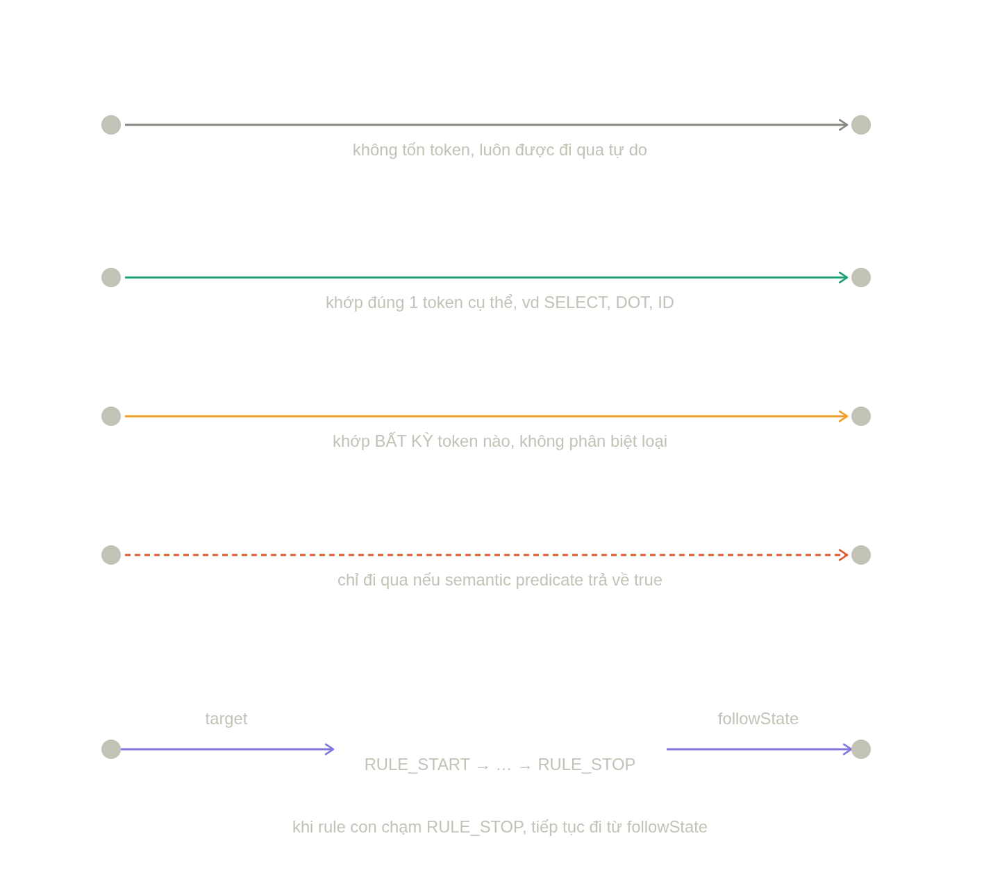

`ATN` (Augmented Transition Network) là đồ thị mà ANTLR biên dịch ra từ grammar — mỗi rule là 1 tiểu đồ thị riêng (có
điểm bắt đầu `RULE_START` và điểm kết `RULE_STOP`), nối với nhau bằng các `Transition`. `processTransition` trong code
chính là xử lý **5 loại cạnh** của đồ thị này:Map trực tiếp vào code (`processTransition`):

- **Epsilon** → `else if (t.isEpsilon())` — đi tiếp `queue.push(new PipelineEntry(t.target, cur.tokenIndex(), stack))`,
  **giữ nguyên `tokenIndex`** vì không tốn token nào. Đây chính là loại transition gây ra bug "colid mất sau DOT" ở đầu
  cuộc trò chuyện — vì nó dùng để nối các cấu trúc tùy chọn/lặp (`(DOT id)*`) mà không tiêu thụ input.

- **Labeled (Atom/Set/NotSet/Range)** → nhánh `else` cuối cùng — so
  `label.contains(tokens.get(cur.tokenIndex()).type())`, nếu khớp thì `tokenIndex + 1` (tốn đúng 1 token). Đây là cách
  literal keyword (`SELECT`, `FROM`...) hay 1 token cụ thể được "ăn".

- **Wildcard** → khớp mọi token (ký hiệu `.` trong grammar, ví dụ `expr: . *` kiểu bắt gì cũng được) — cũng tốn 1 token
  nếu không ở caret.

- **Predicate** → gắn với semantic predicate trong grammar (`{condition}?`) — `checkPredicate` gọi
  `t.getPredicate().eval(parser, ...)`, chỉ đi tiếp nếu `true`, **không tốn token**.

- **RuleTransition** → phức tạp nhất vì nó **nhảy sang cả 1 tiểu-đồ-thị khác** (rule con): `rt.target` là điểm bắt đầu
  của rule con đó, còn `rt.followState` là điểm **quay lại trong đồ thị của rule CHA** sau khi rule con đã đi hết tới
  `RULE_STOP`. Trong code:

```java
for(int end :

traverseATN(rt.target, cur.tokenIndex(),stack)){
        queue.

push(new PipelineEntry(rt.followState, end, stack));
        }
```

`traverseATN(rt.target, ...)` đệ quy đi hết rule con, trả về **tập các `tokenIndex`** mà rule con có thể kết thúc ở đó (
vì 1 rule có thể chấp nhận nhiều độ dài input khác nhau tùy nhánh grammar). Với **mỗi** `end` đó, ta tạo lại 1 điểm tiếp
tục ở `rt.followState` — đây chính là lý do `traverseATN` trả về `Set<Integer>` chứ không phải 1 số duy nhất.

**Về các loại `ATNState`** (mảng `ATN_STATE_TYPE_NAMES` bạn thấy log ra trước đây, dù bản hiện tại đã bỏ log): mỗi state
chỉ là 1 "điểm" trong đồ thị, loại của nó (`RULE_START`, `BASIC`, `STAR_LOOP_ENTRY`, `RULE_STOP`...) chỉ nói lên **nó
được sinh ra từ cấu trúc grammar nào** (bắt đầu rule, vòng lặp `*`/`+`, khối `()`...) — code không quan tâm loại state (
trừ đúng 2 chỗ: `RULE_STOP` để biết rule đã xong, và `RULE_START` là điểm bắt đầu duyệt). Mọi hành vi thực sự nằm ở *
*loại transition đi ra khỏi state đó**, không nằm ở bản thân state.

`shortcutMap[ruleIndex][tokenIndex]` chính là cache "nếu đã đi hết rule này bắt đầu từ tokenIndex này rồi, kết quả (tập
`end`) sẽ luôn giống hệt" — đúng vì đồ thị ATN của 1 rule là cố định, không đổi giữa các lần gọi.