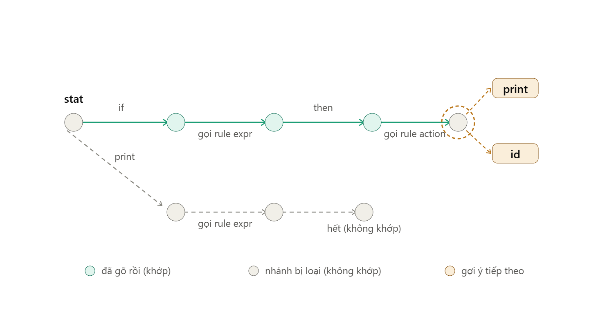

Được, để dễ hiểu **luồng thuật toán** (không phải cấu trúc code), cách tốt nhất là nhìn nó như một cái cây/mê cung mà
mình đang "dò đường" theo input đã gõ. Để mình vẽ minh họa bằng một ví dụ grammar cực nhỏ.Đây là ví dụ với grammar cực
đơn giản:


```
stat   : IF expr THEN action | PRINT expr ;
action : PRINT expr | ID ;
```

Người dùng đã gõ **`if x then`** và con trỏ đang đứng ngay sau đó.

**Đọc sơ đồ theo màu:**

- **Xanh teal** = phần input đã gõ, engine đã "đi qua" đúng đường này (`if` → gọi `expr` → `then`).
- **Xám** = nhánh `print` bị bỏ ngay từ đầu, vì token đầu tiên người dùng gõ là `if`, không phải `print` — đây chính là
  chỗ `canConsumeCurrentToken()` trả về `false` và cắt luôn nhánh đó, không đi tiếp.
- **Vòng tròn nét đứt màu cam** quanh node cuối = đúng vị trí con trỏ (caret). Đây là lúc `isAtCaret()` trả `true`.
- **Ô cam** (`print`, `id`) = candidates mà thuật toán trả về — chính là nội dung của `collectSuggestionsAtCaret()`, lấy
  từ follow-set của rule `action`.

**Cách map sang code, đọc theo đúng thứ tự này sẽ dễ hơn:**

1. `enterRule()` = "mình đang đứng ở node nào, đã gõ tới đâu rồi" — mỗi lần gọi là một bước dọc theo đường xanh.
2. Khi chưa gõ hết: `walkRuleBody()` chỉ đơn giản là — với mỗi mũi tên ra khỏi node hiện tại, **nếu token tiếp theo khớp
   label của mũi tên đó thì đi tiếp, không khớp thì bỏ** (đây chính là 2 nhánh xám/teal ở trên).
3. Khi *hết token để so* (chạm caret): thay vì "đi tiếp", nó chuyển sang chế độ *liệt kê* — nhìn tất cả mũi tên ra khỏi
   node hiện tại và liệt kê nhãn của chúng làm gợi ý. Đó là `collectSuggestionsAtCaret()`.
4. `RuleTransition` (mũi tên "gọi rule expr/action") không tiêu tốn token nào cả — nó chỉ là "nhảy" sang một sub-graph
   khác rồi quay về, nên trong code nó luôn được xử lý đệ quy (gọi lại `enterRule` cho rule con).

**Mẹo đọc code thực tế (không phải sơ đồ):**

- Đừng đọc `walkRuleBody`/`dispatchTransition` trước — nó chỉ là "máy" thực thi 4 luật ở trên cho *từng loại mũi tên* (
  RuleTransition, PredicateTransition, Wildcard, token thường). Đọc nó *sau khi* đã hiểu rõ ví dụ này.
- Chỉ có **2 câu hỏi** engine tự hỏi ở mỗi bước: *"tôi đã hết input để so chưa?"* (`isAtCaret`) và *"token tiếp theo có
  khớp với cái tôi mong đợi không?"* (`canConsumeCurrentToken`). Toàn bộ độ phức tạp còn lại (RuleCallStack, followSets
  cache, preferredRules...) chỉ là *tối ưu hoá* và *ghi nhớ ngữ cảnh* cho 2 câu hỏi đó, không phải logic cốt lõi.
- `preferredRules` / `resolveToPreferredRule` chỉ là một tính năng phụ: thay vì gợi ý từng token lẻ (`print`, `id`), nếu
  bạn báo trước "tôi quan tâm đến rule `expr`" thì nó gộp lại thành "gợi ý: đây là vị trí của rule expr" — hữu ích khi
  rule đó phức tạp (như biểu thức số học) mà liệt kê hết token con thì vô nghĩa.

---
`collectSuggestionsAtCaret()` chạy đúng lúc `isAtCaret()` = true — nó không "đi tiếp" trong ATN nữa, mà **liệt kê những
gì có thể xuất hiện ngay tại đây**. Lấy đúng ví dụ vừa rồi (đang ở rule `action`, stack = `[stat, action]`), nó làm theo
thứ tự sau:

**Bước 1 — Kiểm tra rule hiện tại có phải "preferred" không**

```java
if(preferredRules.containsKey(enteringRuleIndex)){

resolveToPreferredRule(stack);
    return;
            }
```

Nếu bạn đã cấu hình "tôi coi cả rule `action` là một khối, không cần liệt kê token con" → nó dừng ngay ở đây, ghi nhận "
candidate = rule `action`" và **không** đi vào bước liệt kê token bên dưới. Trong ví dụ của mình, giả sử `action` không
phải preferred rule, nên đi tiếp bước 2.

**Bước 2 — Duyệt qua từng "nhánh" trong follow-set đã precompute sẵn cho rule `action`**

Follow-set của state bắt đầu rule `action` (đã tính sẵn từ trước, không phải tính lúc này) chứa 2 nhánh, vì
`action : PRINT expr | ID`:

- nhánh 1: token `PRINT`
- nhánh 2: token `ID`

Với **mỗi nhánh**, code làm:

```java
RuleCallStack fullPath = stack.copy();
fullPath.

appendPath(set.path);          // nối thêm đường đi riêng của nhánh này

if(

resolveToPreferredRule(fullPath)){
        continue;   // nhánh này quy về 1 preferred rule rồi -> khỏi liệt kê token
        }

addTokenSuggestions(set);               // không thì mới liệt kê token thật
```

Ở đây `set.path` thường rỗng vì `PRINT` và `ID` nằm ngay trong rule `action`, không phải đi xuyên qua rule con nào khác
trước khi gặp chúng. Nhưng nếu nhánh đó phải "đi ngang qua" một rule khác trước khi tới được token (ví dụ token đó nằm
sâu trong 1 rule con), `set.path` sẽ ghi lại đường đó — để `resolveToPreferredRule` biết mà chặn lại nếu rule con đó là
preferred.

**Bước 3 — Ghi token vào candidates**

```java
private void addTokenSuggestions(FollowSetWithPath set) {
    for (int sym : set.intervals.toList()) {
        if (ignoredTokens.containsKey(sym)) continue;
        if (!candidates.tokens.containsKey(sym)) {
            candidates.tokens.put(sym, new ArrayList<>(set.following));
        } else if (!candidates.tokens.get(sym).equals(set.following)) {
            candidates.tokens.put(sym, Collections.emptyList()); // mâu thuẫn -> xoá following
        }
    }
}
```

- Với nhánh `PRINT`: thêm `candidates.tokens.put(PRINT, [])`.
- Với nhánh `ID`: thêm `candidates.tokens.put(ID, [])`.

→ **Kết quả cuối cùng**: `candidates.tokens = { PRINT: [], ID: [] }` — đúng như 2 ô cam trong sơ đồ.

**`following` dùng để làm gì?** Đó là danh sách token *chắc chắn* đi theo ngay sau candidate đó (dùng
`getFollowingTokens()` – dò tiếp các `AtomTransition` liên tiếp không rẽ nhánh). Ví dụ nếu grammar có
`KEYWORD1 KEYWORD2 KEYWORD3` liền một mạch không rẽ, gợi ý `KEYWORD1` sẽ kèm `following = [KEYWORD2, KEYWORD3]` — IDE có
thể tự động chèn luôn cả cụm. Nếu cùng 1 token đạt được từ 2 nhánh khác nhau với `following` khác nhau → không còn chắc
chắn nữa → code xoá về `[]` (dòng `else if` ở trên) để tránh gợi ý sai.

Tóm lại: **`collectSuggestionsAtCaret` = với mọi hướng có thể đi tiếp tại vị trí con trỏ, thử quy về 1 rule cha "đáng
chú ý" trước, nếu không thì mới liệt kê token trần trụi + gợi ý phần đuôi chắc chắn đi kèm.**