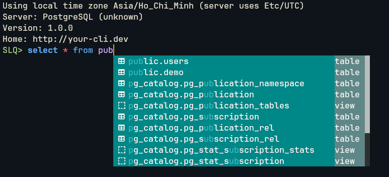

# 🚀 NaviQ CLI

> **Grammar-driven SQL autocomplete powered by ANTLR ATN traversal**

**NaviQ CLI** is a command-line tool that provides **intelligent SQL autocomplete**, built as part of an exploration
into how **ANTLR-based syntax completion** works under the hood.

---

## ✨ Highlights

* ⚡ **Context-aware autocomplete**
* 🧠 **Grammar-driven (ANTLR4)**
* 🔍 **ATN traversal for valid next tokens**
* 🧩 **Understands aliases, CTEs, and subqueries**
* 🖥️ **Custom terminal UI (JLine)**
* 🚀 **Deterministic suggestions (no guessing)**

---

## ⚙️ How It Works

```
input SQL + cursor position
        │
        ▼
ANTLR Lexer → Token Stream
        │
        ▼
locate caret position
        │
        ▼
CompletionCore.collectCandidates()
        │
        ▼
ATN traversal (DFS/BFS)
        │
        ▼
collect:
  - valid tokens
  - valid grammar rules
        │
        ▼
semantic mapping:
  - tables
  - columns
  - functions
  - aliases
        │
        ▼
filter + ranking
        │
        ▼
render → terminal UI
```

---

## 🧠 Core Idea

Instead of guessing:

> ❌ match prefix → filter strings

NaviQ CLI leverages the parser’s internal mechanism:

> ✅ **ANTLR’s ATN (Abstract Transition Network)**

At the cursor position:

* determine the current parser state
* traverse all valid transitions in the ATN
* collect **all possible next tokens and rules**

👉 Result:

* ✔ Suggestions are always **syntactically valid**
* ✔ No heuristics
* ✔ Fully deterministic

---

## 🧩 Architecture

```
          +----------------------+
          |   SQL Input + Caret  |
          +----------+-----------+
                     |
                     v
          +----------------------+
          |      ANTLR Lexer     |
          +----------------------+
                     |
                     v
          +----------------------+
          |     Token Stream     |
          +----------------------+
                     |
                     v
          +----------------------+
          |   Completion Core    |
          |  (ATN Traversal)     |
          +----------------------+
                     |
          +----------+-----------+
          |                      |
          v                      v
+----------------+     +------------------+
| Syntax Tokens  |     | Grammar Rules    |
+----------------+     +------------------+
          \              /
           \            /
            v          v
        +----------------------+
        | Semantic Mapping     |
        | (schema, alias, ctx) |
        +----------------------+
                     |
                     v
        +----------------------+
        |   Suggestion Engine  |
        +----------------------+
                     |
                     v
        +----------------------+
        |    Terminal UI       |
        |      (JLine)         |
        +----------------------+
```

---

## 🎯 Examples

### Basic alias resolution

```sql
select u. from users u
```

**Suggestions:**

```
u.id
u.email
u.created_at
```

---

### CTE-aware completion

```sql
WITH t AS (
  SELECT id, email FROM users
)
SELECT t. FROM t
```

**Suggestions:**

```
t.id
t.email
```

---

### Subquery with alias

```sql
SELECT * FROM (
  SELECT id AS uid, name FROM users
) u
WHERE u.
```

**Suggestions:**

```
u.uid
u.name
```

---

## 🔍 Why Not pgcli?

pgcli is a great tool.

However:

* its autocomplete mainly relies on **heuristics and metadata**
* it does not use **grammar traversal**

👉 NaviQ CLI explores a different approach:

* grammar-driven
* ATN-based
* deterministic completion

---

## 🛠 Tech Stack

* **Java**
* **ANTLR4**
* **JLine**
* **PostgreSQL**

---

## 🎯 Goals

* Gain a deep understanding of how **parsers work**
* Build autocomplete that strictly follows **grammar rules**
* Create a foundation that can be extended to:

    * other languages
    * DSLs
    * configuration languages

---

## 🚧 Status

> Experimental / Side Project

* [x] Basic completion
* [x] Alias resolution
* [x] CTE support
* [x] Subquery support
* [ ] Ranking improvements
* [ ] Performance optimization
* [ ] Multi-database support

---

## 🧪 Final Note

## 🙃 Why not just use pgcli?

I’m **not trying to reinvent the wheel** — there are already many great tools out there, and pgcli is one of them.

The motivation behind building NaviQ CLI is simple:

* I enjoy CLI tools because they are **lightweight, fast, and minimal**
* I wanted to deeply understand how **autocomplete works internally**, especially with ANTLR
* And most importantly:

> 👉 This is just a side project for learning and exploration — not intended to replace pgcli (though it does provide
> noticeably better suggestions for complex queries).

---

NaviQ CLI is built as a playground to:

* experiment with **grammar-driven completion**
* better understand **parsers and ATN traversal**
* explore how to implement autocomplete that is **strictly syntax-aware**
