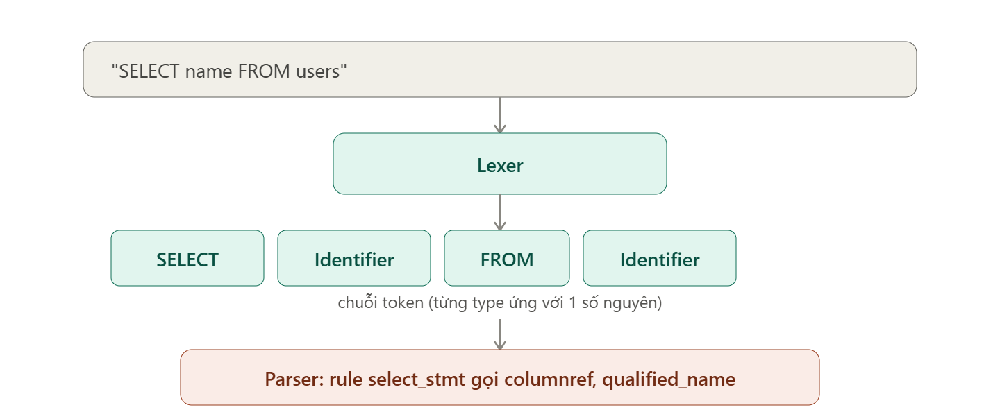

## Token là gì?

**Token** là 1 "cục" nhỏ nhất có ý nghĩa trong chuỗi ký tự đầu vào, do **Lexer** (bộ quét từ vựng) tạo ra bằng cách gom
nhóm các ký tự lại theo quy tắc.

Ví dụ với câu SQL:

```
DROP TABLE public.users
```

Lexer sẽ chia thành các token:

| Ký tự gốc | Token type        | 
|-----------|-------------------|
| `DROP`    | `DROP` (keyword)  |
| `TABLE`   | `TABLE` (keyword) |
| `public`  | `Identifier`      |
| `.`       | `DOT`             |
| `users`   | `Identifier`      |

Mỗi token có 2 thứ quan trọng: **type** (số nguyên định danh loại, vd `DROP` có thể là type = 42) và **text/vị trí**
thật trong chuỗi gốc (offset ký tự). Trong code bạn đang làm, `PostgreSQLParser.Identifier`,
`PostgreSQLParser.OPEN_PAREN`... chính là các hằng số `int` đại diện cho type của token — đây là lý do `ignoredTokens`
là `Map<Integer, Boolean>`: nó lọc theo **type**, không phải theo text cụ thể.

## Rule là gì?

**Rule** là 1 "công thức ngữ pháp" mô tả 1 cấu trúc cú pháp hợp lệ được ghép từ token và/hoặc rule khác — do **Parser**
dùng để hiểu ý nghĩa của chuỗi token. Rule được định nghĩa trong file `.g4`, ví dụ (giản lược):

```antlr
drop_table_stmt
    : DROP TABLE qualified_name (COMMA qualified_name)* (CASCADE | RESTRICT)?
    ;

qualified_name
    : Identifier (DOT Identifier)*
    ;
```

Ở đây `drop_table_stmt` và `qualified_name` đều là rule. Rule có thể:

- Ăn trực tiếp 1 token (`DROP`, `TABLE`)
- **Gọi rule con** (`qualified_name`) — đây chính là `RuleTransition` trong code bạn đang đọc
- Có nhánh rẽ (`|`), lặp (`*`, `+`), tùy chọn (`?`) — tất cả những thứ này được ANTLR biên dịch thành 1 mạng lưới trạng
  thái gọi là **ATN**.

Mỗi rule có 1 con số định danh gọi là **ruleIndex** — đây là lý do `preferredRules` là `Map<Integer, Boolean>` với các
hằng số `PostgreSQLParser.RULE_qualified_name`, `RULE_columnref`...

## Mối quan hệ giữa 2 thứ, và vì sao code bạn đọc lại tách biệt chúngNối lại với đúng code bạn đang đọc:



Với `SELECT name FROM users`:

## Token là gì?

Lexer tách chuỗi ký tự thành 4 token:

| Ký tự gốc | Token type |
|---|---|
| `SELECT` | `SELECT` (keyword) |
| `name` | `Identifier` |
| `FROM` | `FROM` (keyword) |
| `users` | `Identifier` |

Mỗi token có 1 con số **type** (vd `SELECT` có thể là type = 55) và vị trí offset trong chuỗi gốc. `token.getType()` trong code chính là số này.

## Rule là gì?

Rule là công thức ngữ pháp mô tả cấu trúc hợp lệ, định nghĩa trong `.g4`, ví dụ (giản lược):

```antlr
select_stmt
    : SELECT columnref (COMMA columnref)* FROM qualified_name
    ;

columnref
    : Identifier
    ;

qualified_name
    : Identifier (DOT Identifier)*
    ;
```

`select_stmt` ăn trực tiếp 2 token (`SELECT`, `FROM`) và **gọi 2 rule con** (`columnref`, `qualified_name`) — đây chính là `RuleTransition` trong engine. Mỗi rule có 1 con số **ruleIndex** (`PostgreSQLParser.RULE_columnref`, `RULE_qualified_name`...) mà `preferredRules` bạn khai báo đang dùng để "chốt" gợi ý ở đúng rule đó thay vì liệt kê token trần trụi bên trong.

**Ứng với 2 map bạn đã build trước đó**:
- Nếu caret đang ở vị trí `SELECT ` (sau `SELECT`, chưa gõ gì) → caret rơi vào rule `columnref` → vì `RULE_columnref` nằm trong `preferredRules`, engine gợi ý **"đang cần gõ 1 columnref"** thay vì gợi ý token `Identifier` trần trụi (vốn đã bị chặn bởi `ignoredTokens` chứa `PostgreSQLParser.Identifier`).
- Nếu caret ở vị trí `SELECT name ` (sau `name`, chưa gõ gì) → engine gợi ý token thật: `COMMA` hoặc `FROM` (2 lựa chọn cụ thể, không nằm trong `ignoredTokens` nên hiện ra bình thường).