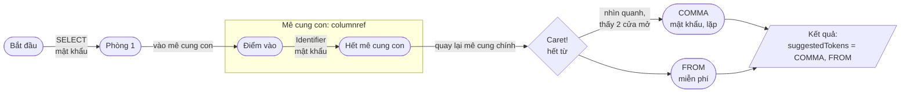

# ATN giải thích bằng ẩn dụ phòng và cửa

## Tưởng tượng grammar là 1 tấm bản đồ trò chơi

Bạn đang chơi 1 trò chơi: mỗi lượt bạn đứng ở **1 căn phòng**, và từ phòng đó có vài **cánh cửa** dẫn sang phòng khác.

Để đi qua 1 cánh cửa, có 3 loại:

1. **Cửa cần mật khẩu** — bạn phải nói đúng 1 từ cụ thể (vd phải nói "SELECT") thì cửa mới mở, và bạn *tốn 1 lượt nói*
   để qua cửa đó.
2. **Cửa miễn phí** — mở sẵn, bạn cứ bước qua, không cần nói gì, không tốn lượt nào cả.
3. **Cửa dẫn vào 1 mê cung con** — bước qua cửa này nghĩa là bạn phải đi hết 1 mê cung nhỏ khác trước (đi qua nhiều
   phòng, nói nhiều mật khẩu khác), xong xuôi mới được quay lại mê cung chính, đúng tại điểm ngay sau cửa, để tiếp tục
   đi tiếp.

**ATN chính là tấm bản đồ này.** Mỗi rule trong grammar là 1 mê cung. `RuleTransition` là "cửa dẫn vào mê cung con" (mê
cung con = rule khác). Cửa miễn phí chính là cái người ta gọi là "epsilon" — chỉ là 1 cái tên kỹ thuật cho "cửa không
cần nói gì".

## Việc engine đang làm

Bạn đưa cho engine 1 câu bạn đã nói (`SELECT name`), engine **giả vờ đi trong mê cung** đúng theo những từ đó — mỗi từ
bạn nói khớp với đúng 1 cửa cần mật khẩu, nó bước qua. Khi bạn nói hết câu (caret), nó đang đứng ở **1 căn phòng cụ thể
nào đó**. Lúc đó nó nhìn quanh phòng: *"phòng này có những cửa nào?"* — tên mật khẩu trên mỗi cửa đó chính là **gợi ý**
cho bạn.

## Sơ đồ minh hoạ

## Đi qua từng hàm trong code, theo đúng câu chuyện trên

**`collectCandidates(caretTokenIndex)`** — đây là lúc bạn bắt đầu ván chơi. Nó dọn sạch kết quả cũ, đọc lại toàn bộ
những lời bạn đã nói (`readTokens`), rồi bước chân vào mê cung chính (rule gốc của grammar), tại đúng ô đầu tiên trên
bàn cờ (`tokenIndex = 0`). Mọi thứ xảy ra sau đó chỉ là hệ quả của 1 lời gọi duy nhất: `enterRule(...)`.

**`enterRule(start, tokenIndex)`** — đây là hành động "bước vào 1 mê cung". Trước khi đi, nó tự hỏi: *"mình đã từng đứng
đúng chỗ này trong mê cung này chưa?"* Nếu rồi, khỏi mất công đi lại, lấy ngay kết quả cũ ra dùng. Nếu chưa, nó đánh dấu
tạm "chỗ này coi như ngõ cụt" (phòng khi đi vòng quay lại đúng chỗ, khỏi lặp vô tận), rồi mới thật sự đi: hết lời để nói
thì nhìn quanh lấy gợi ý (`handleReachedCaretInsideRule`), còn lời thì dò cửa đi tiếp (`walkRuleBody`). Xong xuôi, nó
xoá cái đánh dấu tạm, ghi đè bằng kết quả thật.

**`handleReachedCaretInsideRule(start, tokenIndex)`** — đây là khoảnh khắc bạn vừa bước chân vào 1 mê cung thì hết lời
để nói luôn (chưa kịp đi thêm bước nào bên trong). Nếu mê cung này là loại "đặc biệt" (như `columnref`,
`qualified_name` — những thứ có ý nghĩa nghiệp vụ), nó không thèm liệt kê từng cửa mật khẩu trần trụi bên trong nữa, mà
chốt luôn: "bạn đang cần điền 1 thứ thuộc loại này". Còn nếu là mê cung bình thường, nó vẫn phải dò cửa như thường (gọi
`walkRuleBody`) để biết cửa nào đang mở.

**`canExitWithoutConsumingToken(start)`** — câu hỏi ở đây rất cụ thể: *"đứng ngay tại cửa vào mê cung này, tôi có thể
coi như xong luôn mà không cần nói thêm lời nào không?"* Nó đi thử các cửa miễn phí và cửa vào mê cung con khác (đều
không tốn lời), hễ chạm được "hết mê cung" thì đúng — trả lời có. Gặp cửa mật khẩu là dừng ngay nhánh đó, vì cửa mật
khẩu đồng nghĩa "còn nợ ít nhất 1 lời".

**`walkRuleBody(start, startTokenIndex)`** — đây là màn dò đường thật sự bên trong 1 mê cung. Nó đi từng phòng một, và
với mỗi phòng, xét hết các cửa của phòng đó rồi định tuyến sang đúng người xử lý cửa loại đó. Nếu 1 phòng nào chạm tới "
hết mê cung", nó ghi lại đây là 1 điểm có thể thoát ra.

**`handleRuleDoor`** — xử lý đúng cửa vào mê cung con: đi hết mê cung con đó (gọi lại `enterRule`), rồi bất kể đi ra ở
đâu, luôn tiếp tục từ đúng điểm ngay sau cửa (`rt.followState`) trong mê cung chính.

**`handleFreeDoorWithCondition`** và **`handleFreeDoor`** — đây là 2 kiểu cửa miễn phí: 1 loại có điều kiện đi kèm (mở
nếu điều kiện đúng), 1 loại mở sẵn hoàn toàn. Cả 2 đều không tốn lời nói, chỉ là bước qua rồi tiếp tục.

**`handlePasswordDoor`** — đây là nơi mọi gợi ý thật sự được sinh ra. Nếu hết lời để nói rồi, tên mật khẩu trên cửa này
chính là gợi ý, trừ khi nó nằm trong danh sách bị bỏ qua. Nếu còn lời, nó so xem lời tiếp theo có đúng mật khẩu không —
đúng thì bước qua (tốn 1 lời), sai thì im lặng, coi như ngõ cụt.

## Vì sao phải đi từ đầu, không nhảy thẳng tới Caret

Đúng là 1 khi đã biết chắc đang đứng ở đúng 1 ngã rẽ cụ thể, danh sách cửa ở đó là cố định — không quan tâm chữ trước đó
là gì. Nhưng vấn đề là: **làm sao biết mình đang đứng ở đúng ngã rẽ nào?**

Ví dụ 2 câu này đều "vừa gõ xong 1 identifier, hết từ":

- `SELECT name` → đang ở ngã rẽ `COMMA` / `FROM`
- `SELECT name FROM users WHERE id` → đang ở 1 ngã rẽ khác hẳn (so sánh `=`, `>`, `IN`...)

Cả 2 câu kết thúc giống hệt nhau về hình thức ("vừa gõ 1 identifier"), nhưng là 2 phòng khác nhau, cửa khác nhau hoàn
toàn. Không đi từ đầu thì không thể phân biệt được đang ở trường hợp nào — phải đi đúng đường mới xác định được đang
đứng ở phòng nào.

Tóm lại: đi từ đầu = xác định **đang đứng ở đâu**. Danh sách cửa tại 1 vị trí cụ thể thì đúng là tĩnh, tính 1 lần dùng
lại mãi (đây là lý do bản gốc có cache `FollowSetsByState`) — nhưng đó là chuyện khác, không thay thế được việc phải xác
định vị trí trước.

Đi từ đầu còn giúp phát hiện input sai ngữ pháp: nếu gõ câu không hợp lệ (vd thiếu tên cột), tới cửa cần `Identifier` mà
không có token đó, code không push đi tiếp đâu cả — ngõ cụt, không phòng nào đạt tới, không có gợi ý (đúng như kỳ vọng:
câu sai thì không nên gợi ý bừa).

## Ghép thẳng vào tên biến trong code

| Ẩn dụ                                        | Tên thật trong code                                                                          |
|----------------------------------------------|----------------------------------------------------------------------------------------------|
| Căn phòng                                    | `ATNState`                                                                                   |
| Cửa cần mật khẩu                             | `handlePasswordDoor()` — ăn 1 token thật (`AtomTransition`/`SetTransition`/...)              |
| Cửa miễn phí                                 | `handleFreeDoor()` — epsilon transition (`t.isEpsilon()`)                                    |
| Cửa miễn phí có điều kiện                    | `handleFreeDoorWithCondition()` — semantic predicate (`PredicateTransition`)                 |
| Cửa dẫn vào mê cung con                      | `handleRuleDoor()` — gọi rule con qua `RuleTransition`                                       |
| "Đi hết mê cung con, quay lại mê cung chính" | `enterRule()` chạy đệ quy xong, trả về `exitTok`, code `queue.push(rt.followState, exitTok)` |
| "Nhìn quanh phòng liệt kê tên các cửa"       | đoạn code trong `handlePasswordDoor()`: `if (atCaret) { suggestedTokens.add(sym); }`         |

## Hai khái niệm còn lại: "đã đi qua chưa" và "có thể coi như xong không"

**"Đã đi qua đúng chỗ này chưa?"** — mỗi mê cung, tại mỗi vị trí lời nói cụ thể, chỉ cần dò 1 lần. Lần sau có ai (kể cả
1 nhánh khác) hỏi lại đúng câu đó, cứ trả lời y hệt lần trước, khỏi dò lại. Đây là `ruleExitCache` trong code — nó nhớ
đúng theo cặp (mê cung, vị trí lời nói), và có 1 mẹo nhỏ: trong lúc đang dò dở, nó tạm ghi "coi như ngõ cụt" vào chỗ nhớ
đó trước, để nếu lỡ đi vòng quay lại đúng chỗ đang dở này (mê cung có đường vòng), nó không bị lặp mãi — dò xong thật sự
rồi mới ghi đè lại bằng kết quả thật.

**"Mê cung này có thể coi như xong ngay không, dù chưa nói thêm gì?"** — có những mê cung mà bạn vừa bước vào là có thể
coi như xong luôn (không phải cửa nào cũng bắt buộc phải mở), nhờ toàn đường miễn phí dẫn thẳng ra ngoài. Đây là
`canExitWithoutConsumingToken()` — nó chỉ đi theo cửa miễn phí (và cửa vào mê cung con khác, vì cửa đó cũng không tốn
lời) để dò xem có lối nào ra ngoài mà không cần mở cửa mật khẩu nào không. Nếu KHÔNG có lối như vậy, thì mê cung cha
phải hiểu là "còn nợ ít nhất 1 lời nữa bên trong", và không được phép coi như xong.

Không có gì thần bí cả — cả file `AntlrCompletionEngineSimple.java` chỉ đang làm đúng 1 việc: **đi theo đúng những từ
bạn đã gõ trong tấm bản đồ đó, rồi khi hết từ để đi, nhìn quanh xem còn cửa nào mở** — tên mật khẩu trên các cửa đó
chính là kết quả trả về.